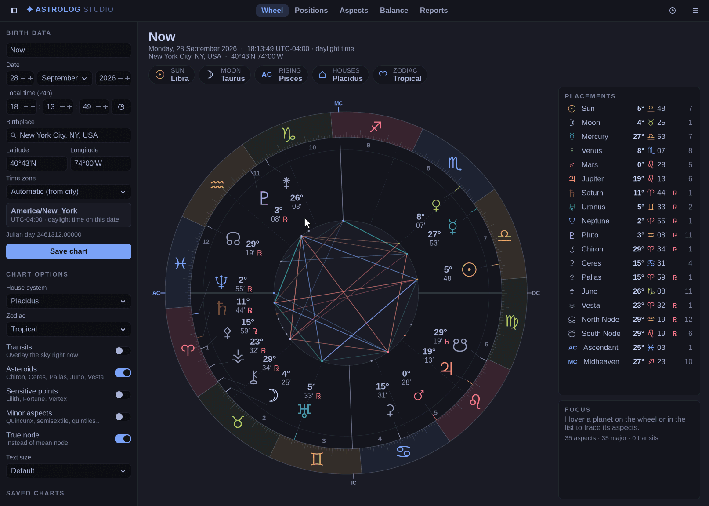

# Astrolog Studio

A modern GTK 4 desktop interface for **[Astrolog](https://www.astrolog.org/astrolog.htm)
8.00**, the astrology program by **Walter D. Pullen**. It uses Astrolog's
own calculation engine, atlas and reports, and matches the look of the
[Omarchy](https://omarchy.org) desktop, including live theme switching.



> **This is an unofficial, modified version of Astrolog.** It is not made,
> endorsed or supported by Walter D. Pullen. Please don't send him reports
> about problems with this version. The official program, documentation and
> source code are at <https://www.astrolog.org/astrolog.htm>.

## Features

- **Birth data form**: name, date and 24-hour time, plus birthplace search
  over Astrolog's atlas of about 33,000 cities. Coordinates can also be typed
  directly (`40.71`, `74W00`, `40°43'N`…).
- **Automatic historical time zones**: the time zone and daylight saving in
  effect on the birth date come from Astrolog's time-zone history. Charts
  from before standard time was adopted use local mean time.
- **Live recasting**: every edit recalculates the chart immediately.
- **Views**:
  - an interactive chart wheel (hover a planet to trace its aspects), with an
    optional transit ring for the current sky;
  - a table of positions and house cusps;
  - an aspect grid and an aspect list sorted by orb;
  - an element, modality and hemisphere balance view;
  - 16 of Astrolog's text reports, including interpretations, midpoints,
    Arabic parts, transits, progressions and astro-graph lines.
- **Options**: all 40 Astrolog house systems, tropical or sidereal zodiac,
  asteroids, sensitive points, minor aspects, and true or mean node.
- **Saved chart library** and remembered preferences.
- **Omarchy integration**: colors come from the active Omarchy theme and
  update live when the theme changes. Widget corners follow Hyprland's
  rounding, and reports use the Omarchy monospace font. On other desktops a
  built-in palette is used.

See [studio/README.md](studio/README.md) for details, keyboard shortcuts
and the code layout.

## Building

Requirements: a C++17 compiler, GTK 4 development files, `pkg-config`. The
chart symbols are drawn with Noto Sans Symbols (`noto-fonts`) and the
interface prefers the Inter font. Both are optional but recommended.

```sh
make studio            # builds ./astrolog-studio
./astrolog-studio
make install-studio    # optional: desktop launcher + icon for the current user
make uninstall-studio
```

The classic Astrolog command line/X11 program still builds with plain `make`.
The studio binary also runs as the classic command line program:
`./astrolog-studio --cli -qa 7 4 1990 14:30 5 74W00 40N43`.

## What was changed from Astrolog 8.00

This repository contains the Astrolog 8.00 source release with these changes:

- **Added** `studio/`: the GTK 4 front end (new code), plus `README.md`,
  `LICENSE`, `.gitignore` and `docs/`.
- **Modified** `astrolog.h`: the `#define X11` line is wrapped in
  `#ifndef ASTROLOG_NO_X11` so the engine can be compiled without X11.
- **Modified** `Makefile`: added the `studio`, `install-studio`,
  `uninstall-studio` and `clean-studio` targets.
- **Not included**: the `font/` directory of the official release (third-party
  astrology fonts, some under restrictive licenses, and not used by Astrolog
  Studio) and the original `ast80src.zip` archive. Both are available from
  the official Astrolog download page.

Each modified file carries a dated notice of the change, as GPL v2
section 2(a) requires. All original copyright, credit and license notices are
preserved unchanged.

## License

Astrolog is free software released under the **GNU General Public License,
version 2** (or, at your option, any later version). See [LICENSE](LICENSE)
and the original [license.htm](license.htm). Astrolog Studio (the code in
`studio/`) is distributed under the same license. This program comes with
**no warranty of any kind**.

Some components included here carry their own copyright notices and terms,
which also apply:

- **Swiss Ephemeris**: the main ephemeris routines (`swe*.cpp`, `swe*.h`) and
  data files (`ephem/*.se1`, `sefstars.txt`, `seorbel.txt`) are from the
  Swiss Ephemeris library. Its use is subject to the Swiss Ephemeris license
  stated in the copyright notice at the top of those source files (AGPL or the
  Swiss Ephemeris Professional License). See
  <https://www.astro.com/swisseph/>.
- **Placalc**: additional ephemeris formulas (`placalc*.cpp`, `placalc.h`) are
  subject to the conditions in their copyright notices.
- **Atlas**: `atlas.as` was composed by Astrolog from
  [GeoNames](https://www.geonames.org/) data, licensed under the
  [Creative Commons Attribution 4.0 License](https://creativecommons.org/licenses/by/4.0/).
- **Time zones**: `timezone.as` was converted from the public-domain
  [IANA TZ database](https://data.iana.org/time-zones/tz-link.html).

## Credits

- **Astrolog**: Copyright © 1991–2026 **Walter D. Pullen**
  (<https://www.astrolog.org/astrolog.htm>). Astrolog, its chart display
  routines, calculation engine, atlas and time-zone handling, interpretations
  and text reports are his work. Run `./astrolog-studio --cli -Hc` to see
  Astrolog's complete credits screen.
- **Swiss Ephemeris**: provides Astrolog's main ephemeris databases and
  calculation routines; see the copyright notice in `sweph.cpp`.
- **Placalc**: Astrolog's older ephemeris library and formulas; see the
  copyright notice in `placalc.cpp`.
- **James Neely**: Astrolog's original planetary calculation formulas were
  converted from his routines in *Manual of Computer Programming for
  Astrologers* by Michael Erlewine (Matrix Software).
- **Brian D. Willoughby**: Astrolog's PostScript graphics routines.
- **GeoNames** (city atlas, CC BY 4.0) and the **IANA TZ database**
  (time-zone history).
- **Astrolog Studio** (the `studio/` front end): Copyright © 2026 Ryan Arthur.
